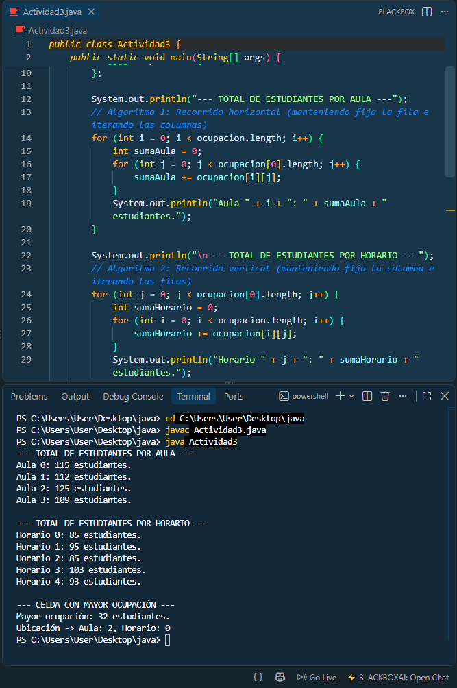
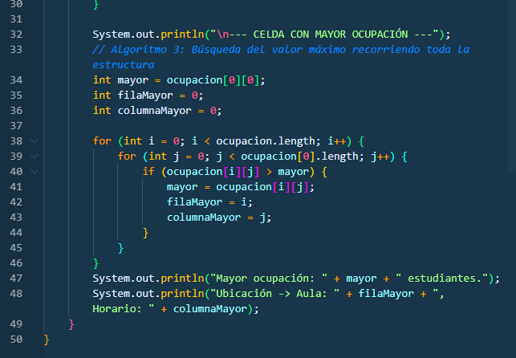

# README — Evaluación

> **Curso:** ALGORITMO Y ESTRUCTURA DE DATOS BASADOS EN INTELIGENCIA ARTIFICIAL  
> **Código:** 4134.202620 
> **Evaluación:** PA1  
> **Equipo:** Delta 

## 1. Integrantes

| Integrante | Rol | Aporte principal |
|---|---|---|
| Jack Stefano Tello Caballero | Coordinador de repositorio y analista | Desarrollo de la Actividad 1 (Diferencias entre estructuras estáticas/dinámicas y justificación teórica). Creación del repositorio en GitHub y estructuración del archivo README.md. |
| Jean Luc Mellet | [Desarrollador de Algoritmos (Vectores)] | [Desarrollo de la Actividad 2. Diseño de algoritmos para arreglos unidimensionales (inserción, búsqueda y ordenamiento) y justificación de la eficiencia algorítmica en el mejor y peor caso.] |
| Johann Condor Vargas | Desarrollador de Algoritmos (Matrices) | Desarrollo de la Actividad 3. Modelado de la matriz bidimensional (4x5) y programación de los recorridos con ciclos anidados para calcular la ocupación por aulas y bloques horarios. |
| Carlos Josue Flores Pareja | Investigador y Editor Audiovisual | Desarrollo de la Actividad 4 (Investigación técnica sobre matrices cuadradas y matrices poco densas para la optimización de memoria). Coordinación, grabación y subida del video de exposición a YouTube. |

## 2. Descripción y objetivo

**Problema:**  
Una coordinación académica necesita un sistema en su primera etapa para organizar la información de los talleres estudiantiles, registrando la cantidad de alumnos inscritos y controlando la distribución de ocupación en aulas y horarios mediante estructuras de memoria estática.

**Objetivo:**  
Diseñar y sustentar una solución técnica utilizando arreglos unidimensionales (vectores) y bidimensionales (matrices) para registrar, ordenar y consultar datos de forma eficiente, analizando la complejidad de las operaciones en diferentes casos.

**Solución desarrollada:**  
Se implementaron algoritmos para manipular un vector de inscritos `[28, 15, 34, 21, 19, 40, 12, 26]` (búsqueda, inserción y ordenamiento burbuja)[cite: 4, 6]. Además, se modeló una matriz de 4x5 para gestionar la ocupación de aulas por bloque horario, proponiendo el uso de "matrices poco densas" (sparse matrix) para optimizar el consumo de memoria en caso de existir horarios vacíos.


## Desarrollo de Actividades Teóricas

### Actividad 1. Análisis del problema y selección de estructura
**1. Estructura estática vs dinámica:** 
La diferencia fundamental radica en cómo gestionan su tamaño en la memoria. Las estructuras estáticas se definen antes de la ejecución del programa y su tamaño permanece fijo e inalterable. Por el contrario, las estructuras dinámicas asignan su memoria durante el tiempo de ejecución, lo que les permite crecer o reducir su tamaño según la cantidad de información[cite: 10]. 

**2. Por qué resulta adecuado trabajar con arreglos y matrices:** 
Para la primera etapa de este sistema, usar arreglos (vectores) y matrices es ideal porque son estructuras estáticas que organizan los datos en bloques contiguos de memoria[cite: 10]. Esto garantiza un acceso directo y muy rápido a la información mediante índices. Los arreglos sirven para listar las cantidades de inscritos, mientras que las matrices permiten modelar información en dos dimensiones (filas y columnas), lo cual encaja exacto con la necesidad de cruzar datos de aulas y bloques horarios sin hacer compleja la gestión de memoria[cite: 9, 11]. 

**3. Relación entre dato, algoritmo y estructura:**
Estos tres conceptos funcionan como un engranaje[cite: 10]:
* El **dato** es la unidad básica de información con la que operamos (por ejemplo, el número "28" que representa a los alumnos inscritos)[cite: 10]. 
* La **estructura de datos** es la herramienta que utilizamos para organizar y almacenar esos datos de manera lógica[cite: 10]. 
* El **algoritmo** es la secuencia ordenada de pasos que programamos para actuar sobre esa estructura[cite: 10] (por ejemplo, el proceso matemático para ordenar el arreglo o sumar los alumnos). 

### Actividad 4. Matrices especiales y decisión técnica
* **Matriz Cuadrada:** Es aquella matriz donde la cantidad de filas es igual a la de columnas (dimensión $n \times n$). Nos sirve cuando necesitamos relacionar un mismo grupo de elementos, calcular determinantes o hacer recorridos simétricos en diagonal.
* **Matriz Poco Densa (Sparse Matrix):** Es una matriz donde casi todas las casillas están vacías o tienen ceros, y solo unas pocas guardan información útil o valores reales[cite: 11].
* **Ejemplo académico y justificación técnica:**
El caso: Si creamos una tabla para ver qué talleres escogen los alumnos, poniendo a 500 estudiantes en las filas y 50 talleres en las columnas, tendríamos una matriz completa de 25,000 celdas[cite: 11]. Pero en la vida real, un estudiante solo se inscribe a 1 o 2 talleres, lo que significa que más del 95% de la tabla estará llena de ceros.
**Por qué conviene la matriz poco densa:** Porque nos ahorra recursos valiosos de memoria RAM (al no guardar ceros innecesarios) y hace que los algoritmos de búsqueda sean mucho más rápidos[cite: 11]. En términos de eficiencia, el algoritmo pasa de un costo $O(n^2)$ a un orden mucho más rápido $O(k)$[cite: 11], ya que no pierde tiempo iterando sobre los espacios vacíos.

## 3. Cómo ejecutar o revisar

```bash
# Escribir aquí los comandos necesarios
```

**Pasos de revisión:**
# 1. Clonar el repositorio en tu computadora local
git clone [https://github.com/Yac02/Examen-PA1-Algoritmos-G4.git](https://github.com/Yac02/Examen-PA1-Algoritmos-G4.git)

# 2. Navegar a la carpeta del proyecto
cd Examen-PA1-Algoritmos-G4

## 3. Cómo ejecutar o revisar
javac Actividad2.java
java Actividad2

> No publicar contraseñas, tokens, credenciales ni datos sensibles.

## 4. Evidencias

Agregar aquí capturas, resultados, pruebas o enlaces que demuestren el funcionamiento.

- Evidencia 1 - Operaciones con Vectores (Actividad 2):
  
- Evidencia 2 - Recorrido de Matrices (Actividad 3):
  
- Evidencia 3 - Búsqueda en Matriz (Actividad 3):
  

## 5. Matriz de participación

| Integrante | Desarrollo | Pruebas | Documentación | Exposición | Evidencia de participación |
|---|---|---|---|---|---|
| Jack Stefano Tello Caballero | Media | Media | Alta | Sí | Creación del repositorio en GitHub, commits principales, redacción de la Actividad 1 y estructuración del README.md. |
| Jean Luc Mellet | Alta | Alta | Media | Sí | Programación de Actividad2.java, implementación de ordenamiento burbuja y búsqueda, pruebas y captura de consola. |
| Johann Condor Vargas | Alta | Alta | Media | Sí | Programación de Actividad3.java, diseño de algoritmos con ciclos anidados, pruebas en consola y captura de evidencias. |
| Carlos Josue Flores Pareja | Media | Baja | Alta | Sí | Investigación teórica de la Actividad 4, redacción de la justificación de matrices poco densas, y edición/subida del video grupal a YouTube. |


## 6. Video de exposición

**Video público de YouTube:** [Ver video de exposición en YouTube](https://youtu.be/giTmCFzh0v0)

Todos los integrantes deben participar en la exposición con sus cámaras prendidas y explicar el procedimiento, la solución desarrollada y las decisiones tomadas.

## 7. Conclusiones

- Estructuras Estáticas: Se comprobó que los arreglos unidimensionales (vectores) son la estructura estática idónea para organizar datos homogéneos, garantizando un acceso rápido y directo a la memoria mediante el uso de índices fijos.
- Procesamiento Bidimensional: Las matrices amplían la capacidad de los arreglos permitiendo cruzar variables complejas en filas y columnas. Además, el análisis demostró que el uso de matrices poco densas (sparse matrix) es una decisión técnica vital para optimizar el consumo de memoria cuando existe un alto volumen de datos nulos.
- Eficiencia Algorítmica: Evaluar los algoritmos (como el ordenamiento burbuja) utilizando la notación de orden de crecimiento (Big-O) permite comprender sus límites en el mejor y peor caso. Esto asegura que el código desarrollado no solo resuelva el problema actual de la coordinación académica, sino que sea escalable frente a mayores volúmenes de datos.

---

**Última actualización:** 23/09/2026
